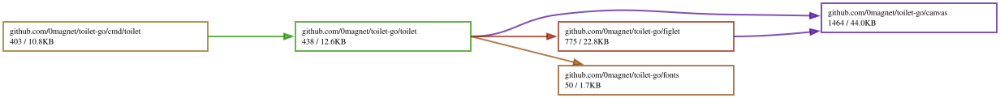

# toilet-go

A Go port of [TOIlet](https://github.com/cacalabs/toilet) 0.3 by Sam Hocevar,
the FIGlet replacement from the libcaca project. It renders text with FIGlet
and TOIlet fonts, colors and turns the result with filters, and writes it out
in any of libcaca's export formats.

**Live demo** — `toilet` runs in a browser tab as a command in
[tuiwasm](https://0magnet.github.io/tuiwasm/)'s shell window, which registers
it from this package. Open the shell and type:

```
toilet -f smblock hello | lolcat
```

That is a real pipeline through websh's interpreter, into
[lolcat-go](https://github.com/0magnet/lolcat-go). The applet carries a subset
of the options — `-f`, `-F`, `-w` and the layout modes — and refuses the rest
rather than pretending; the full CLI is the binary below.

No cgo, no libcaca — a single static binary with the TOIlet font collection
built in.

```
╺┳╸┏━┓╻╻  ┏━╸╺┳╸   ┏━╸┏━┓
 ┃ ┃ ┃┃┃  ┣╸  ┃ ╺━╸┃╺┓┃ ┃
 ╹ ┗━┛╹┗━╸┗━╸ ╹    ┗━┛┗━┛
```

(that is `toilet -f future toilet-go`)

## Install

```
go install github.com/0magnet/toilet-go/cmd/toilet@latest
```

## Use

The command line matches the original:

```
toilet -f future "Hello, World!"
toilet -f smblock --gay "rainbow text"
toilet -f mono9 -w 40 -F border "in a box"
echo "piped in" | toilet -f pagga -F metal
toilet -f smblock -E html "Hi" > art.html
toilet -d ~/figlet-fonts -f standard "your own fonts"
```

Run `toilet --help` for the full option list. All of the original's options are
implemented: `-f` font, `-d` font directory, `-w` width, `-t` terminal width,
the five render modes (`-s`, `-S`, `-k`, `-W`, `-o`), `-F` filters, `-E` export
format, the `--gay`/`--rainbow`/`--metal`/`--irc`/`--html` shorthands, `-I`
infocodes, `-h` and `-v`.

## What is ported

**FIGfont parsing.** Both `.flf` and `.tlf` fonts, plain, gzipped or zipped,
with the full header — hardblank, height, baseline, maximum length, the signed
old layout number, the full layout bitfield, print direction and code tag
count. Glyphs are the mandatory ninety-five printable ASCII characters and the
seven German ones, then any number of extra glyphs introduced by a decimal or
`0x` hexadecimal code tag.

**Layout.** Full width, kerning, overlapping and smushing, and the rules that
decide which of them a font asks for when none is named on the command line.

**Smushing.** All six horizontal rules from the FIGfont specification: equal
characters, underscore replacement, the hierarchy of `| /\ [] {} () <>`,
opposite bracket pairs, the big X, and the hardblank rule.

**Filters.** `crop`, `rainbow`, `metal`, `flip`, `flop`, `180`, `left`,
`right`, `border` and the undocumented `rotate` alias, chained with colons.

**Export formats.** All twelve libcaca supports: `caca`, `ansi`, `utf8`,
`utf8cr`, `html`, `html3`, `bbfr`, `irc`, `ps`, `svg`, `tga`, `troff`.

The canvas and the export codecs come from
[img2txt-go](https://github.com/0magnet/img2txt-go)'s `caca` package, which is
already a port of that half of libcaca. This repository adds what TOIlet needs
on top: the content-preserving resize, blitting with a handle, cropping, the
flip and rotate transforms, the UTF-8 and ECMA-48 canvas importer, and the
FIGfont engine itself.

## Fonts

The twenty-four fonts TOIlet installs are bundled, so the binary works with
nothing else on the machine. They are separate works from the program: every
one is by Sam Hocevar under the WTFPL, which the hand-written ones state in
their own comment block and which the generated ones inherit from TOIlet's
`COPYING` and from the grant its version banner prints — *"TOIlet, along with
the various TOIlet fonts and documentation, may be freely copied and
distributed."* The wording is quoted in full in `fonts/LICENSE`.

Fonts from the **figlet** collection are deliberately **not** bundled. They are
the work of many authors under many licenses, several of which do not permit
redistribution. Install them yourself — Debian and Ubuntu have `figlet`,
Arch has `figlet`, Homebrew has `figlet` — and point `-d` at the directory:

```
toilet -d /usr/share/figlet -f standard "Hello"
```

`-d` and `./` are searched before the bundled collection, so a font installed
on the system shadows a bundled one of the same name.

## Verification

`toilet-go` was diffed against the system `toilet` 0.3 (libcaca 0.99.beta20),
comparing stdout, stderr and exit status:

| Suite | Comparisons | Result |
|---|---|---|
| 18 figlet `.flf` fonts × 6 layout modes × 25 texts | 2,700 | all identical |
| 24 TOIlet `.tlf` fonts + `term` × 6 modes × 25 texts | 3,750 | all identical |
| 12 fonts × 13 widths × 3 layouts | 468 | all identical |
| 24 filter chains × 5 fonts × 3 texts | 360 | all identical |
| 10 export formats × 5 fonts × 4 renders, plus TGA × 3 fonts × 4 texts | 212 | all identical |
| 20 stdin corpora × 5 fonts × 3 option sets | 300 | all identical |
| Option parsing, infocodes, errors, compressed fonts | 84 | all identical |
| Fuzz: random text × random fonts, modes, filters, widths, formats | 29,999 | all identical |

(The fuzzer ran 30,000 cases over six seeds; the one left out is the crash
described below, where there is no C output to compare against.)

The corpus covers every layout mode, the smushing characters, hardblanks,
Unicode and fullwidth text, malformed UTF-8, ANSI escape sequences in the
input, embedded NUL bytes, form feeds, lines longer than the original's 1024
byte buffer, and gzipped and zipped font files. The fuzzer generates text
biased towards the characters the smushing rules care about, with occasional
random code points.

The `.flf` fonts came from the figlet source tree; they are used for testing
only and are not redistributed here.

Two exports are outside that count, because the C program's own output is not
reproducible:

- **`-E tga`** rasterises the canvas with libcaca's built-in bitmap font and
  `malloc`s the pixel buffer without clearing it. Cells whose glyph is missing
  from that font are left untouched, so the file contains uninitialized heap;
  three consecutive runs of the C binary produce three different files. This
  port writes zeroes there. Where every glyph *is* in the font, TGA output is
  byte-identical, and those cases are in the table above.
- **`-E troff`** indexes a sixteen-entry color table with libcaca's color
  constants, which reach 0x20 for transparent, and prints whatever lies past
  the end of the array — in practice `\m[]` and `\M[(null)]`. This port masks
  the index instead and emits a real color name.

## Differences from the original

- **Fonts are bundled.** With no `-d` and no `/usr/share/figlet`, the original
  fails; this port falls back to its built-in collection. Everything else about
  font lookup is the same, and a font on disk still wins.
- **`-F flip` on a zero-width render does not crash.** libcaca's `caca_flip`
  walks each row from `chars` to `chars + width - 1`; on an empty canvas
  `realloc` has handed back a null pointer, so that end pointer wraps and the
  loop dereferences null. A font with a zero-width glyph reaches it —
  `toilet -f bfraktur -W -F flip /` segfaults. Here it produces the empty
  render.
- The two export formats above.

Everything else is deliberately faithful, including behavior that is more
accident than design:

- The color filters shift their pattern by a line counter that TOIlet
  initializes and never advances, so the second line of a multi-line render is
  colored exactly like the first. The counter that does advance lives inside
  libcaca's figfont state and is not the one the filters read.
- Smushing rule 6, which merges two hardblanks, is unreachable: libcaca guards
  rules 2 to 6 behind "both characters below U+0080" and holds a hardblank as
  U+00A0. Rule 1 refuses hardblank pairs outright, so hardblanks never smush at
  all — which is what keeps the column they hold open.
- A glyph's attribute is written at the column the glyph started in rather than
  the column it landed in after smushing, so a colored render is offset from
  the characters it colors.
- A blank line or a negative code tag inside a font still consumes a glyph
  slot, which shifts every later glyph up by one. `ivrit.flf` renders wrong in
  both implementations, in the same way.
- `caca_file_open` reads a zipped font by skipping the local file header and
  inflating a raw deflate stream, ignoring the central directory. Only the
  first member of an archive is reachable, here as there.
- `-w` and `-I` parse their arguments with C's `atoi`, so `-w 3x` is a width of
  three and `-w -5` comes back from `-I 4` as 4294967291.
- A line read from stdin is measured with `strlen`, so an embedded NUL byte
  truncates it.

## Library

```go
import (
    "os"

    "github.com/0magnet/toilet-go/figlet"
    "github.com/0magnet/toilet-go/toilet"
)

// Render text through a FIGfont.
f, _ := figlet.LoadFont("/usr/share/figlet/standard")
r := figlet.NewRenderer(f)
r.SetMode(figlet.ModeSmush)
for _, ch := range "Hello" {
    r.PutChar(ch)
}
cv := r.Flush()
out, _ := cv.Export("utf8")

// Or drive the whole program.
cx := toilet.New()
cx.Font = "future"
_ = cx.AddFilter("rainbow")
_ = cx.Render([]string{"Hello"}, nil, os.Stdout)
```

`figlet.Smush` exposes the smushing rules on their own, and the `canvas`
package has the libcaca canvas operations the renderer is built on.

## License

WTFPL, the same as TOIlet and libcaca. See `LICENSE`.

Original TOIlet is copyright © 2006 Sam Hocevar <sam@hocevar.net>; libcaca is
copyright © 2002-2021 Sam Hocevar and Jean-Yves Lamoureux
<jylam@lnxscene.org>.

The bundled fonts are separate works under their own license; see
`fonts/LICENSE`.

## Dependency Graph

Made with [goda](https://github.com/loov/goda):

```
go run github.com/loov/goda@latest graph github.com/0magnet/toilet-go/... | dot -Tsvg -o docs/toilet-go-goda-graph.svg
```



## Lines of Code

Made with [gocloc](https://github.com/hhatto/gocloc) (excludes `vendor/`, `node_modules/`, `.git/`):

```
gocloc --not-match-d='(vendor|node_modules|\.git)' .
```

```
-------------------------------------------------------------------------------
Language                     files          blank        comment           code
-------------------------------------------------------------------------------
Go                              25            641            642           4297
Markdown                         1             52              0            193
YAML                             1              0              7             98
-------------------------------------------------------------------------------
TOTAL                           27            693            649           4588
-------------------------------------------------------------------------------
```
